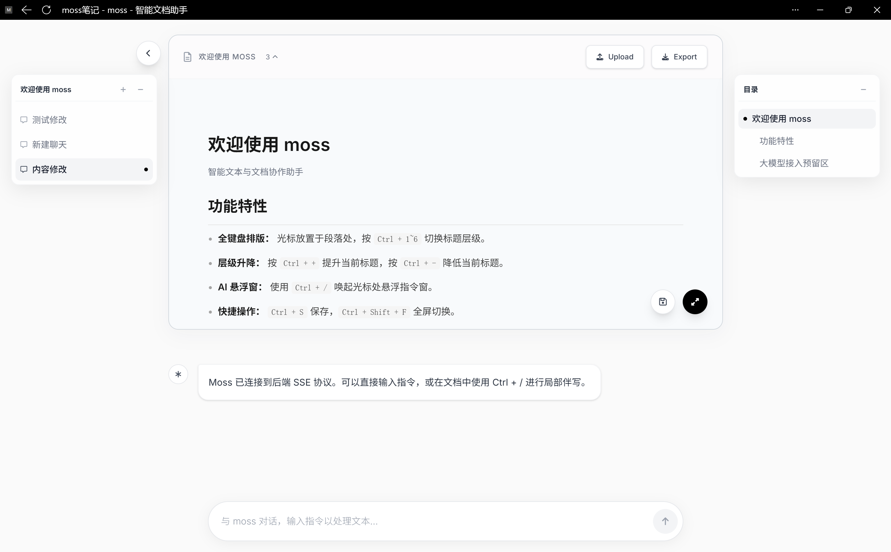

# Moss 文档助手




Moss 是一个本地运行的 AI 文档编辑器。它希望解决的不是“让 AI 生成一段文字”，而是让用户在可编辑的富文本里和 AI 一起写、改、问，避免在聊天框里生成结果后再反复复制、粘贴和重改。

## 它解决什么问题

很多 AI 写作工具的结果是一次性的：AI 生成一段内容后，用户如果直接接受，就很难继续精细调整；如果把一个很小的改动继续交给 AI，又可能因为上下文和模型随机性导致结果变化过大，甚至改坏原本满意的段落。

Moss 的核心思路是把 AI 放回文档编辑现场。用户可以自己手动修改，也可以让 AI 只处理当前段落、某句话或光标附近的内容。对于长文档，Moss 不默认把全文都交给模型，而是根据任务只传入必要的上下文，让 AI 更容易定位用户真正想问或想改的位置。

## 它怎么工作

用户在编辑器里写文档，Moss 会维护文档块和光标位置。用户发起指令后，后端 Agent 会判断这是普通问答、局部修改还是全文处理，并裁剪对应的文档上下文。

如果只是回答问题，Agent 会返回聊天内容；如果需要修改文档，Agent 会生成结构化的修改事件，前端再把修改应用回富文本编辑器。这样 AI 的产出不会脱离文档，也不会默认覆盖整篇内容。

## 快速运行

```powershell
cd moss_backend
python -m venv .venv
.\.venv\Scripts\Activate.ps1
pip install -r requirements.txt
uvicorn app.main:app --reload --host 127.0.0.1 --port 8000
```

浏览器访问：

```text
http://127.0.0.1:8000/
```

笔记库入口：

```text
http://127.0.0.1:8000/library
```

前端会从 CDN 加载 Vue、Tiptap 和 Font Awesome，因此浏览器需要能访问相关 CDN。

## 配置真实模型

默认情况下项目使用 Mock LLM，用来跑通前后端连接和 SSE 基础链路，不会调用真实模型。

最小配置示例：

```env
ENABLE_MOCK_LLM=true
LLM_API_KEY=
LLM_BASE_URL=https://api.deepseek.com
LLM_MODEL=deepseek-chat
LLM_TEMPERATURE=0.2
STORAGE_DIR=storage
```

如果要验证真实的意图识别、文档问答和局部修改，需要配置 OpenAI 兼容模型：

```env
ENABLE_MOCK_LLM=false
LLM_API_KEY=你的密钥
```

配置会从以下位置读取：

```text
moss_backend/app/core/.env
moss_backend/.env
.env
```

## 更多技术细节

- 后端接口、Agent 流程、文档工具和测试说明：`moss_backend/README.md`
- 当前系统设计说明：`Blueprint/SYSTEM_DESIGN.md`
- 开发计划和历史方案：`docs/superpowers/plans/`

注意：`docs/superpowers/plans/` 中的文件是开发计划或历史方案，不等同于已实现功能。


1. 1
2. 2
3. 3
4. 4
5. 5
6. 56
7. 7
8. 7
9. 7
10. 7
11. 7
12. 7
13. 7
14. 7


1. 
